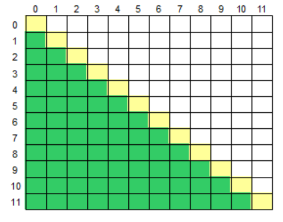
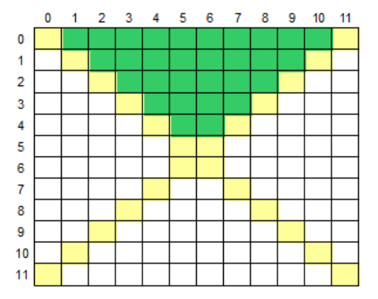
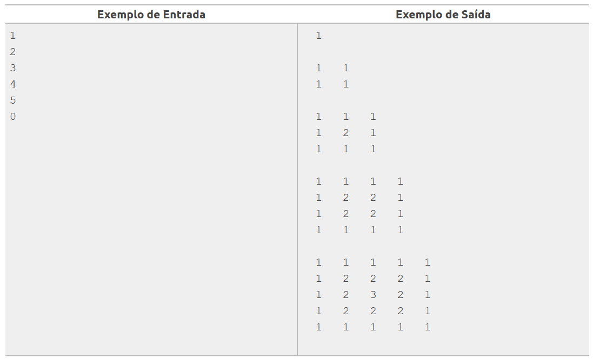

**Os índices das questões são clicáveis e levam à resolução do exercício.**

[1.](1.py) **Abaixo da Diagonal Principal**

Leia um caractere maiúsculo, que indica uma operação que deve ser realizada e uma matriz M[12][12]. Em seguida, calcule e mostre a soma ou a média considerando somente aqueles elementos que estão abaixo da diagonal principal da matriz, conforme ilustrado abaixo (área verde).

**Entrada:**

A primeira linha de entrada contém um único caractere Maiúsculo O ('S' ou 'M'), indicando a operação (Soma ou Média) que deverá ser realizada com os elementos da matriz. 
O preenchimento da matriz pode ser feito lendo valores do teclado ou randomicamente.

**Saída:**
    
Imprima o resultado solicitado (a soma ou média), com 1 casa após o ponto decimal.

[2.](2.py) **Área Superior**

Leia um caractere maiúsculo, que indica uma operação que deve ser realizada e uma matriz M[12][12]. Em seguida, calcule e mostre a soma ou a média considerando somente aqueles elementos que estão na área superior da matriz, conforme ilustrado abaixo (área verde).

**Entrada**

A primeira linha de entrada contém um único caractere Maiúsculo O ('S' ou 'M'), indicando a operação (Soma ou Média) que deverá ser realizada com os elementos da matriz. 
O preenchimento da matriz pode ser feito lendo valores do teclado ou randomicamente.

**Saída**

Imprima o resultado solicitado (a soma ou média), com 1 casa após o ponto decimal.

[3.](3.py) **Matriz Quadrada I**

Escreva um algoritmo que leia um inteiro N (0 ≤ N ≤ 100), correspondente a ordem de uma matriz M de inteiros, e construa a matriz de acordo com o exemplo abaixo.

**Entrada**

A entrada consiste de vários inteiros, um valor por linha, correspondentes as ordens das matrizes a serem construídas. O final da entrada é marcado por um valor de ordem igual a zero (0).

**Saída**

Para cada inteiro da entrada imprima a matriz correspondente, de acordo com o exemplo. Os valores das matrizes devem ser formatados em um campo de tamanho 3 justificados à direita e separados por espaço. Após o último caractere de cada linha da matriz não deve haver espaços em branco. Após a impressão de cada matriz deve ser deixada uma linha em branco.

