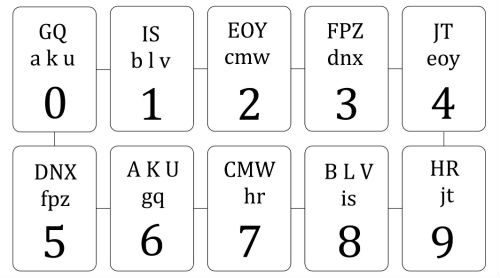

**Os índices das questões são clicáveis e levam à resolução do exercício.**

**Estes são exercícios do URI**

[1.](1.py) [Esquerda, Volver!](https://www.urionlinejudge.com.br/judge/pt/problems/view/1437)
Este ano o sargento está tendo mais trabalho do que de costume para treinar os recrutas. Um deles é muito atrapalhado, e de vez em quando faz tudo errado – por exemplo, ao invés de virar à direita quando comandado, vira à esquerda, causando grande confusão no batalhão. O sargento tem fama de durão e não vai deixar o recruta em paz enquanto este não aprender a executar corretamente os comandos. No sábado à tarde, enquanto todos os outros recrutas estão de folga, ele obrigou o recruta a fazer um treinamento extra. Com o recruta marchando parado no mesmo lugar, o sargento emitiu uma série de comandos "Esquerda, Volver!" e "Direita, Volver!". A cada comando, o recruta deve girar sobre o mesmo ponto e dar um quarto de volta na direção correspondente ao comando. Por exemplo, se o recruta está inicialmente com o rosto voltado para a direção norte, após um comando de "esquerda volver!" ele deve ficar com o rosto voltado para a direção oeste. Se o recruta está inicialmente com o rosto voltado para o leste, após um comando "Direita, volver!" ele deve ter o rosto voltado para o sul. No entanto, durante o treinamento, em que o recruta tinha inicialmente o rosto voltado para o norte, o sargento emitiu uma série tão extensa de comandos, e tão rapidamente, que até ele ficou confuso, e não sabe mais para qual direção o recruta deve ter seu rosto voltado após executar todos os comandos. Você pode ajudar o sargento?
Entrada:
    A entrada contém vários casos de teste. A primeira linha de um caso de teste contém um inteiro N que indica o número de comandos emitidos pelo sargento (1 ≤ N ≤ 1000)). A segunda linha contém N caracteres, descrevendo a série de comandos emitidos pelo sargento. Cada comando é representado por uma letra: 'E' (para "Esquerda, volver!") e 'D' (para "direita, volver!"). O final da entrada é indicado por N = 0.
Saída:
    Para cada caso de teste da entrada seu programa deve produzir uma única linha da saída, indicando a direção para a qual o recruta deve ter sua face voltada após executar a série de comandos, considerando que no início o recruta tem a face voltada para o norte. A linha deve conter uma letra entre 'N', 'L', 'S' e 'O', representando respectivamente as direções norte, leste, sul e oeste.

[2.](2.py) [Nova Senha RA](https://www.urionlinejudge.com.br/judge/pt/problems/view/2690) 
Um novo conjunto de autenticação será implementado no Instituto Federal do Sul de Minas, campus Muzambinho.

Bom, o novo serviço de autenticação é seguro, sem bugs e dores de cabeça mesmo porque estamos no final de semestre. Ele permitirá que sua senha tenha espaços, mas não números ou caracteres especiais. A atualização ocorre sempre no período de férias, para que todos os ajustes sejam feitos e no final agrade todos os usuarios. Como estagiário da central de suporte da escola, seu dever é implementar a nova autenticação. Por enquanto o novo padrão para nomes de usuários está sendo estudado.

Como podemos perceber para cada conjunto de letras teremos um numero especifico. Bole um programa maroto para fazer essa conversão das letras para os números, e como você não acessará as senhas dos alunos, faça um algoritmo para que o mesmo faça o processo sozinho usando seus proprios casos de teste.

Obs: Seus casos de teste não poderão passar de 20 caracterese e a saída, 12 digitos.

Entrada:
    Você terá N indicando a quantidade de senhas que serão trocadas, em seguida N casos de testes.

Saída:
    A saída será uma lista com os novos números, criptografados das senhas que foram digitadas.