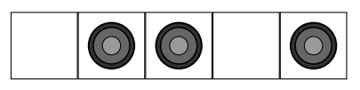
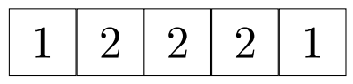

**Os índices das questões são clicáveis e levam à resolução do exercício.**

**Os exercícios 10, 11 e 12 são do URI**

[1.](1.py) Desenvolva um programa que leia 10 valores pelo teclado e guarde-os em uma lista. No final mostre:
- Quantas vezes apareceu o valor 9 (se não houver, deve ser digitada uma mensagem informando que o número não consta na tupla)
- Em que posição foi inserido o primeiro valor 3
- Quais foram os números pares

[2.](2.py) Crie uma tupla contendo os nomes de alunos da turma de POO (considere 10 alunos). Seu programa deve verificar em que posição está o aluno Pedro. Verifique também quantos alunos com nome Maria constam na tupla.

[3.](3.py) Criar um programa que gere 5 números aleatórios e os insira em uma lista. Depois mostre a listagem dos números e também indique o maior e o menor valor da lista.

[4.](4.py) Crie uma tupla única contendo nomes dos produtos e seus respectivos preços (tema livre) estoque = (‘Arroz’, 3.5, ‘Alface’, 2.5, ‘rúcula’, 3)
Por exemplo:
Faça uma função que simule o funcionamento de um operador de caixa, calculando o valor total da compra.  A quantidade de cada produto deve ser lida do teclado. Condição de encerramento da compra deve ser consultada ao cliente após cada produto.

[5.](5.py) Crie um programa onde o usuário possa digitar vários valores numéricos e cadastre-os em uma lista. Caso o número já exista na lista, ele não será adicionado. Após a criação da lista composta por elementos únicos, fazer uma função que ordene os elementos da lista  e retorne a lista ordenada.
Importante: deve ser implementado o algoritmo de ordenação (não utilizar função sort) 
Não utilizar random.sample para evitar números repetidos.

[6.](6.py) Criar um função onde o usuário digite 5 valores numéricos e cadastre-os em uma lista, já na posição ordenada de inserção (sem usar o sort() ). No final mostre a lista ordenada na tela.

[7.](7.py) Criar um programa que deverá ler vários números do teclado e colocar em uma lista. Depois disto, crie 2 listas extras, que irão conter apenas os valores pares e ímpares respectivamente. No final, mostre o conteúdo das 3 listas.

[8.](8.py) Escreva um programa que tenha uma função  que recebe um array de inteiros “a” e retorne um array de boolean onde, cada posição indique true se o elemento da posição correspondente de a é positivo e false caso seja negativo ou zero.

[9.](9.py) Escreva uma função que recebe um array de números e devolve a posição onde se encontra o maior valor do array. Se houver mais de um valor maior, devolver a posição da primeira ocorrência.

[10.](10.py) [Número Primo](https://www.urionlinejudge.com.br/judge/pt/problems/view/1165)
Na matemática, um Número Primo é aquele que pode ser dividido somente por 1 (um) e por ele mesmo. Por exemplo, o número 7 é primo, pois pode ser dividido apenas pelo número 1 e pelo número 7.

Entrada:
    A entrada contém vários casos de teste. A primeira linha da entrada contém um inteiro N (1 ≤ N ≤ 100), indicando o número de casos de teste da entrada. Cada uma das N linhas seguintes contém um valor inteiro X (1 < X ≤ 107), que pode ser ou não, um número primo.

Saída:
    Para cada caso de teste de entrada, imprima a mensagem “X eh primo” ou “X nao eh primo”, de acordo com a especificação fornecida.

[11.](11.py) [Campo Minado](https://www.urionlinejudge.com.br/judge/pt/problems/view/2399)
Leonardo Viana é um garoto fascinado por jogos de tabuleiro. Nas férias de janeiro, ele aprendeu um jogo chamado "Campo minado", que é jogado em um tabuleiro comN células dispostas na horizontal. O objetivo desse jogo é determinar, para cada célula do tabuleiro, o número de minas explosivas nos arredores da mesma (que são a própria célula e as células imediatamente vizinhas à direita e à esquerda, caso essas existam). Por exemplo, a figura abaixo ilustra uma possível configuração de um tabuleiro com 5 células:

A primeira célula não possui nenhuma mina explosiva, mas é vizinha de uma célula que possui uma mina explosiva. Nos arredores da segunda célula temos duas minas, e o mesmo acontece para a terceira e quarta células; a quinta célula só tem uma mina explosiva em seus arredores. A próxima figura ilustra a resposta para esse caso.

Leonardo sabe que você participa da OBI e resolveu lhe pedir para escrever um programa de computador que, dado um tabuleiro, imprima o número de minas na vizinhança de cada posição. Assim, ele poderá conferir as centenas de tabuleiros que resolveu durante as férias.

Entrada:
    A primeira linha da entrada contém um inteiro N (1 ≤ N ≤ 50) indicando o número de células no tabuleiro. O tabuleiro é dado nas próximas N linhas. A i-ésima linha seguinte contém 0 se não existe mina na i-ésima célula do tabuleiro e 1 se existe uma mina na i-ésima célula do tabuleiro.

Saída:
    A saída é composta por N linhas. A i-ésima linha da saída contém o número de minas explosivas nos arredores da i-ésima célula do tabuleiro.

[12.](12.py) [Número Perfeito](https://www.urionlinejudge.com.br/judge/pt/problems/view/1164)
Na matemática, um número perfeito é um número inteiro para o qual a soma de todos os seus divisores positivos próprios (excluindo ele mesmo) é igual ao próprio número. Por exemplo o número 6 é perfeito, pois 1+2+3 é igual a 6. Sua tarefa é escrever um programa que imprima se um determinado número é perfeito ou não.

Entrada:
    A entrada contém vários casos de teste. A primeira linha da entrada contém um inteiro N (1 ≤ N ≤ 20), indicando o número de casos de teste da entrada. Cada uma das N linhas seguintes contém um valor inteiro X (1 ≤ X ≤ 108), que pode ser ou não, um número perfeito.

Saída:
    Para cada caso de teste de entrada, imprima a mensagem “X eh perfeito” ou “X nao eh perfeito”, de acordo com a especificação fornecida.